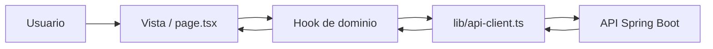

# ucu-talent-frontend

Frontend web del proyecto **Talent** (Reto Julio 2026 - UCU).

Portal laboral tipo LinkedIn para la Universidad Católica del Uruguay. El frontend consume una API REST separada y no expone backend propio ni accede directamente a la base de datos.

## Qué resuelve

La aplicación permite autenticarse, completar el perfil, explorar vacantes, postularse, gestionar vacantes desde la cuenta de empresa y moderar cuentas y publicaciones desde administración.

## Stack

- **Next.js 16** (App Router)
- **React 19**
- **TypeScript**
- **Tailwind CSS v4**
- **shadcn/ui** sobre **Radix UI**
- **TanStack Query v5** para fetching y cache de datos
- **React Hook Form + Zod v4** para formularios
- **sonner** para notificaciones
- **next/font** con **Inter** y **Geist Mono**
- **Docker** y **Docker Compose** para ejecución contenedorizada

## Arquitectura del proyecto

El proyecto se organiza por **rutas** y por **dominio**. `app/` se encarga de composición y navegación; `features/` concentra la lógica de negocio; `components/` contiene piezas compartidas; `lib/` agrupa infraestructura transversal; y `types/` reúne las entidades core compartidas por toda la app.

### Capas principales

#### `app/`
Contiene el routing del App Router y los layouts por segmento. Acá viven las rutas, los layouts raíz y de grupo, y las páginas delgadas que solo componen componentes de `features/`.

Dentro de `app/` hay principalmente:

- `layout.tsx`: layout raíz, fuentes, `Providers` y `Toaster`.
- `globals.css`: tokens globales, tipografía y estilos base.
- `(auth)/`: login y registro.
- `(alumno)/`: feed y postulaciones.
- `(empresa)/`: puestos, postulantes y creación de oferta.
- `(perfil)/`: perfil compartido entre alumno y empresa.
- `(admin)/`: moderación.
- `completar-perfil/`: flujo de continuación del alta cuando falta completar el perfil.

Las páginas dentro de esas carpetas son delgadas: componen componentes de `features/` y no concentran lógica de dominio.

#### `features/`
Agrupa la funcionalidad por dominio de negocio (`auth`, `perfil`, `puestos`, `postulaciones`, `moderacion`). Cada dominio puede tener componentes, hooks, tipos y datos propios.

#### `components/layout/`
Incluye el shell compartido de la app: navbar, sidebar, page header, empty states y navegación. Son componentes de interfaz reutilizables entre roles.

#### `components/ui/`
Son los primitivos visuales de la interfaz. Se apoyan en shadcn/ui y Radix, y se reutilizan en toda la aplicación.

#### `lib/`
Contiene código transversal sin UI: cliente HTTP, helpers de autenticación, validadores y utilidades.

#### `types/`
Define las entidades globales del modelo de datos compartidas entre dominios.

### Flujo de datos

El flujo habitual es: la vista llama a un hook de dominio, el hook usa `lib/api-client.ts`, la API responde, y el hook normaliza el resultado para la interfaz.



## Rutas principales

- `/` redirige según la sesión del usuario.
- `/login` y `/registro` cubren autenticación y alta.
- `/completar-perfil` reanuda el alta cuando falta el perfil.
- `/feed` y `/postulaciones` son las pantallas del alumno.
- `/puestos`, `/puestos/[id]` y `/postulantes` cubren el flujo de empresa.
- `/perfil` es una vista compartida entre alumno y empresa.
- `/moderacion/*` agrupa las pantallas de administración.

## Requisitos previos

- **Node.js 20.9.0 o superior**
- **npm**
- Una API de backend disponible y compatible con el contrato esperado por el frontend
- **Docker** si se quiere ejecutar la aplicación en contenedores

## Configuración

Copiá la plantilla de variables de entorno y completá los valores locales:

```bash
cp .env.example .env.local
```

Variables relevantes:

- `NEXT_PUBLIC_API_URL`: URL base pública de la API de Spring Boot (la usa `lib/api-client.ts`).
- `NEXT_PUBLIC_API_BASE_URL`: build arg usado por `Dockerfile`/`docker-compose.yml` para inyectar la URL de API en build time.
- `NEXT_PUBLIC_MOCK_SESSION`: modo temporal de desarrollo sin backend. Valores válidos: `ALUMNO`, `EMPRESA`, `ADMIN`.
## Cómo ejecutar

```bash
npm install
npm run dev
```

La app queda disponible en [http://localhost:3000](http://localhost:3000).

### Scripts disponibles

```bash
npm run dev     # Desarrollo
npm run build   # Build de producción
npm run start   # Ejecutar el build de producción
npm run lint    # Lint del proyecto
```

## Docker

Requiere Docker instalado localmente. Si se usa Docker, la URL base de la API debe estar disponible en build time porque el frontend la inyecta en el bundle del navegador.

### Build y ejecución manual

```bash
docker build --build-arg NEXT_PUBLIC_API_BASE_URL=https://api.ejemplo.com -t ucu-talent-frontend .
docker run -p 3000:3000 ucu-talent-frontend
```

### Con Docker Compose

```bash
docker compose up --build
```

En ambos casos, la app queda disponible en [http://localhost:3000](http://localhost:3000).

## Estructura del proyecto

```text
ucu-talent-frontend/
├── app/                      # Rutas, layouts y páginas del App Router
│   ├── layout.tsx            # Layout raíz
│   ├── globals.css            # Estilos y tokens globales
│   ├── (auth)/               # Login y registro
│   ├── (alumno)/             # Feed y postulaciones
│   ├── (empresa)/            # Puestos, postulantes y creación de oferta
│   ├── (perfil)/             # Perfil compartido
│   ├── (admin)/              # Moderación
│   └── completar-perfil/     # Continuación del alta
├── components/               # UI compartida y layout global
├── features/                 # Lógica de negocio por dominio
├── lib/                      # Cliente HTTP, auth, validadores y utilidades
├── public/                   # Archivos estáticos
├── types/                    # Entidades core compartidas
├── Dockerfile
├── docker-compose.yml
├── package.json
└── README.md
```

## Convenciones generales

- El frontend trabaja con **fetching centralizado**: las requests pasan por `lib/api-client.ts`.
- La sesión se resuelve mediante **cookie httpOnly** y `GET /me`; el cliente no lee tokens directamente.
- Los formularios se construyen con **React Hook Form + Zod**.
- La lógica de dominio vive en `features/`, no en `app/`.
- Los componentes compartidos viven en `components/`, y los primitivos visuales en `components/ui/`.

## Documentación adicional

- `AGENTS.md`: reglas de arquitectura y convenciones del equipo.
- `CLAUDE.md`: referencia al mismo documento de reglas.
